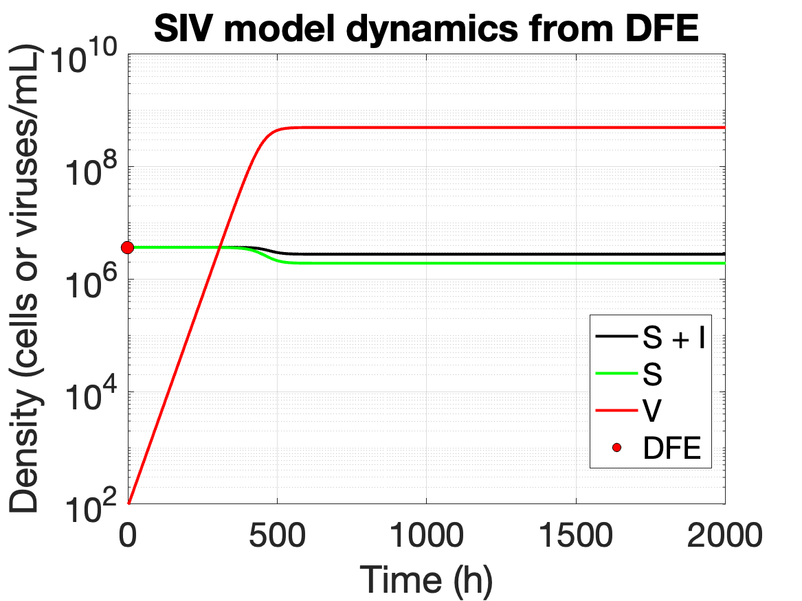

# Matlab - Exercises


##  SV lytic model
### Simulate a viral invasion -

Consider the SV model for lytic infections with susceptible cells (S) and free viruses (V) given by,
\begin{align}
\dot{S} &= bS (1- S/K) - \phi SV - dS 
\end{align}
\begin{align}
\dot{V} &= \beta\phi SV - \phi SV - mV
\end{align}

use the following set of parameter values:

$$ \phi = 6.7 \times 10^{-10} \ \mathrm{mL} \ \mathrm{h}^{-1} $$
 $$  m = 1/24 h^{−1} $$
  $$ d = 1/4 h^{−1}$$
 $$ b = 0.95 h^{−1}$$
$$ K = 7.5\times 10^7 \text{cell mL}^{−1}$$
 $$ \beta = 50$$ virus/cell 


### SV simulation

Starting with the SV model, initiate an ‘inoculation’, adding $S0 = 10^4 $cell/mL of microbe, and
then letting the population reach its equilibrium after approximately 24 h.

Question: What population density does it reach? Is it what you expect? Compare your numerical simulation of S at the end of the simulation with the value of the equilibrium that you found analytically. Numerically, create a function describing the SV model and integrate it using python.

Solution:
This is the SV ODE
```
function dydt = SV_ode(t, y, pars)
    % Standard SV model ODEs
    S = y(1);
    V = y(2);
    phi = pars.phi;
    m = pars.m;
    d = pars.d;
    b = pars.b;
    K = pars.K;
    beta = pars.beta;

    dS = b*S*(1 - S/K) - phi*S*V - d*S;
    dV = beta*phi*S*V - phi*S*V - m*V;

    dydt = [dS; dV];
end
```
simulate it with

```matlab
% Time settings
t0 = 0;      % Initial time (hours)
tf = 24;     % Final time (hours)
T = linspace(t0, tf, 250);  % Time vector

% Initial conditions
y0 = [1e4; 0];  % [S0; V0] (V0 is 0 by default)

% Parameters
pars.phi = 6.7e-10;
pars.m = 1/24;
pars.d = 1/4;
pars.b = 0.95;
pars.K = 7.5e7;
pars.beta = 50;

% Solve ODE
[T_out, Y] = ode45(@(t,y) SV_ode(t, y, pars), T, y0);

% Extract S and compute equilibrium value
S = Y(:,1);
Seq_num = S(end);

% Plotting
figure;
plot(T_out, S, 'k', 'LineWidth', 2); hold on;
scatter(T_out(end), Seq_num, 80, 'red', 'filled');
legend('S(t)', 'S^* numerically', 'Location', 'best', 'Box', 'on');
xlabel('Time (h)');
ylabel('S cells/mL');
title('SV numerical integration');
set(gca,'FontSize',20);
grid on;

% Save figure
saveas(gcf, 'SV_model_plot.png');
```
to get the saved figure


Analytically, we find that in the absence of virus in the system $(V0 = 0), \dot{V} = 0$ and the system remains disease-free. The SV system reduces to the logistic model with cell death, 
$\dot{S} = bS(1- S/K) - dS$ Solving $\dot{S} = 0$ we find that S approaches the equilibrium point $S^∗ = K(1-d/b)$

```matlab
% Plotting
figure;
plot(T_out, S, 'k', 'LineWidth', 2); hold on;
scatter(T_out(end), Seq_num, 80, 'red', 'filled');
plot(T_out, Seq_ana * ones(size(T_out)), 'g--', 'LineWidth', 2);
legend('S(t)', 'S^* numerically', 'S^* analytically', 'Location', 'best', 'Box', 'on');
xlabel('Time (h)');
ylabel('S cells/mL');
title('SV numerical integration with equilibrium');
set(gca,'FontSize',20);
grid on;

% Save figure
saveas(gcf, 'SV_model_equilibrium_plot.png');
```

to get the saved figure


### Finding out basic reproduction number

Beginning from the disease-free equilibrium, add $V_0$ = 100 virus/mL and using β = 50 virus/cell for the burst size, estimate the basic reproduction number $R_0$.

**Question:** What is the value of $R_0$ and what can you tell about the viral invasion? Simulate the dynamical system, do the viruses increase in abundance?

**Answer:** The reproduction number is the number of newly infected induced by one infected in a
fully susceptible population. It is a threshold value, that indicates if the virus is going to invade or
being washed-out. When $R_0 > 1$ the virus has a positive growth rate and invade the population,
when $R_0 <= 1$ the virus has negative or null population growth rate and is not able to invade.
We want to find a condition for invasion, you can solve $\dot{V} > 0 (\text{ at } S∗)$ (disease free equilibrium) for
a initial inoculation of virus V0:

\begin{align}
 \dot{V} &= \beta\phi S^* V_0 - \phi S^* V_0 -mV_0
\end{align}


\begin{align}
  \beta\phi S^* > \phi S^* +m
\end{align}

The basic reproduction number of the system is $R_0 > \frac{\beta\phi S^* }{\beta\phi S^* +m}$ 


```matlab
% Analytical equilibrium
Seq_ana = pars.K * (1 - pars.d / pars.b);

% Compute R0
R0 = (pars.beta * pars.phi * Seq_ana) / (pars.phi * Seq_ana + pars.m);
fprintf('R0 = %.4f\n', R0);
```

R0 = 23.5258

```matlab
% Updated initial conditions (start from DFE + virus)
y0 = [Seq_ana; 100];

% Solve ODE
[T_out, Y] = ode45(@(t,y) SV_ode(t, y, pars), T, y0);

% Extract solutions
S = Y(:,1);
V = Y(:,2);

% Plot semilog
figure;
semilogy(T_out, S, 'k', 'LineWidth', 2); hold on;
semilogy(T_out, V, 'r', 'LineWidth', 2);
scatter(0, Seq_ana, 80, 'red', 'filled', 'DisplayName', 'DFE');
legend('S(t)', 'V(t)', 'DFE', 'Location', 'best', 'Box', 'on');
xlabel('Time (h)');
ylabel('Density (cells or viruses/mL)');
title('SV numerical integration from DFE');
grid on;

% Save figure
saveas(gcf, 'SV_model_DFE_plot.png');
```
saved figure


### Estimating growth rate of virus population 

Estimate the growth rate of the virus population.
**Question:** Does it agree with your theoretical expectations?
**Answer:** Evaluate $$ \dot{V}|_{S= S^∗}$$. 

\begin{align}
1/V dV/dt = \beta\phi S^* - \phi S^* -m 
\end{align}


\begin{align}
 r = \beta\phi S^* - \phi S^* -m
\end{align}


 $ S^{* } $ by is expression and re-arranging:
$ r = (\beta-1)\phi K (1-d/b) -m  $

Numerically estimate the slope of log(V ) over time during the exponential growth phase and compare with the above equation for r with parameter values substituted.

```matlab
% Take log of virus counts
logV = log(V);

% Select exponential growth phase (e.g., T(2:15))
idx = 2:15;  % MATLAB is 1-indexed
x_reg = T_out(idx)';
y_reg = logV(idx);

% Fit linear regression model
coeffs = polyfit(x_reg, y_reg, 1);
r_num = coeffs(1);  % Slope of the line (exponential rate)
y_fit = polyval(coeffs, x_reg);

% Calculate R^2
SS_res = sum((y_reg - y_fit).^2);
SS_tot = sum((y_reg - mean(y_reg)).^2);
r_sq = 1 - SS_res / SS_tot;

% Display numerical results
fprintf('Numerical estimate:\n');
fprintf('r_num = %.5f\n', r_num);
fprintf('R^2 = %.4f\n', r_sq);

% Plot log(V)
figure;
scatter(T_out, logV, 'filled'); hold on;
scatter(x_reg, y_reg, 60, 'r', 'filled');
plot(x_reg, y_fit, 'b-', 'LineWidth', 2);
xlabel('Time (h)');
ylabel('log(V)');
title('Log(V) and exponential phase linear fit');
legend('log(V)', 'Exponential phase', 'Linear fit', 'Location', 'best');
grid on;
set(gca,'FontSize',24);
saveas(gcf, 'growth_estimate.png');

```
saved figure


Finally, plot the dynamics in the phase plane and evaluate whether the system converges to a new
coexistence equilibrium - in doing so compare the equilibrium to theory, noting how the bacterial
density changes and to what extent the dynamics exhibit cycles or not.

### Phase space plots

**Question:** Finally, plot the dynamics in the phase plane and evaluate whether the system converges to a new
coexistence equilibrium - in doing so compare the equilibrium to theory, noting how the bacterial
density changes and to what extent the dynamics exhibit cycles or not.

**Answer:** Range over the phi to see how the solution trajectories change in the phase. For sufficient small ϕ, no invasion will occur. For large enough ϕ, invasion occurs, and you
can find closed cycles by running out long enough. For intermediate values of ϕ, invasion occurs
but population now tend towards and an equilibrium point.

The endemic equilibrium is 
$$
S^* = m/(\beta -1)\phi
$$

$$
V^* = \frac{1}{\phi} (d-b-\frac{bm}{(\beta -1)\phi K})
 $$


```matlab
% Time parameters
t0 = 0;
tf = 5000;
dt = 0.1;
T = t0:dt:tf;

% Shared parameters
pars.m = 1/24;
pars.d = 1/4;
pars.b = 0.95;
pars.K = 7.5e7;
pars.beta = 50;

% Different phi values
phi_values = [1e-12, 1e-9, 1e-5];
titles = {'Low \phi', 'Medium \phi', 'High \phi'};

figure;

for i = 1:3
phi = phi_values(i);
pars.phi = phi;

% Initial condition & equilibrium calculations
if phi == 1e-12
    y0 = [1000; 100];
    Seq_ana = pars.K * (1 - pars.d / pars.b);
    dy = ode45(@(t, y) SV_ode(t, y, pars), T, y0);
    Y = deval(dy, T);
    S = Y(1, :);
    V = Y(2, :);
else
    Seq = pars.m / ((pars.beta - 1) * pars.phi);
    Veq = (1 / pars.phi) * (pars.b * (1 - Seq / pars.K) - pars.d);
    if phi == 1e-5
        y0 = [Seq + 250; Veq + 500];
    else
        y0 = [1000; 100];
    end
    dy = ode45(@(t, y) SV_ode(t, y, pars), T, y0);
    Y = deval(dy, T);
    S = Y(1, :);
    V = Y(2, :);
end

% Plot in subplot
subplot(1, 3, i)
loglog(S, V, 'LineWidth', 2); hold on;
scatter(y0(1), y0(2), 60, 'r', 'filled', 'DisplayName', 'Initial condition');
scatter(S(end), V(end), 60, 'g', 'filled', 'DisplayName', 'Final condition');

if phi == 1e-12
    scatter(Seq_ana, 1e-20, 60, 'b', 'filled', 'DisplayName', 'DFE');
    xline(Seq_ana, 'k--', 'DisplayName', 'S* (DFE)');
else
    scatter(Seq, Veq, 60, 'k', 'filled', 'DisplayName', 'Endemic Eq.');
    xline(Seq, 'k--', 'DisplayName', 'S*');
    yline(Veq, 'k--', 'DisplayName', 'V*');
end

xlabel('Microbe S');
ylabel('Virus V');
title(titles{i});
legend('Location', 'best');
grid on;
end

sgtitle('Phase Plane (log-log) for Different \phi Values');
end

```
saved figure


## SIV model
Consider the SIV model with susceptible S cells, infected I cells and free virus particles V ,

\begin{align}
\dot{S} &= bS (1- \frac{S+I}{K}) - \phi SV - dS\\
\dot{I} &= \phi SV - \eta I - dI\\
\dot{V} &= \beta\phi SV - \phi SV - mV
\end{align}

Use the following set of parameter values:

$$ \phi = 6.7 \times 10^{-10} \ \mathrm{mL} \ \mathrm{h}^{-1} $$

 $$  m = 1/24 h^{−1} $$

  $$ d = 1/4 h^{−1}$$

 $$ b = 0.95 h^{−1}$$

 $$ \eta = 1 h^{−1}$$

$$ K = 5\times 10^7 \text{cell mL}^{−1}$$


### Basic reproduction number

Beginning from the disease-free equilibrium, add V0 = 100 virus/mL with a burst β = 50 virus/cell
and a lysis rate η = 0.5 hours. Estimate the basic reproduction number R0.

**Question:** Is R0 > 1? Simulate the dynamical system and conclude on the invasion of the virus.

**Answer** For zero initial viral density. 
$$ \dot{S} = 0$$

$$ S^* = K(1-\frac{d}{b}) $$

R0 = viral production * probability to infect before virus die * probability to lyse before cells
die.
S0, $$ R_0 = \beta  \frac{mS^* }{mS^* +m } \frac{\eta}{\eta+d}$$


```matlab
#Estimate the R0
# parameters
pars={}
pars["phi"] = 6.7E-10
pars["m"] = 1/24
pars["d"] = 1/4
pars["b"] = 0.95
pars["K"] = 5E6
pars["beta"] = 50
pars["eta"] = 0.5
# DFE
S_DFE = pars["K"]*(1-pars["d"]/pars["b"])
prod = pars["beta"]
proba_lyse = pars["phi"]*S_DFE/(pars["phi"]*S_DFE+pars["m"])
proba_inf = pars["eta"]/(pars["eta"]+pars["d"])


R0 = prod*proba_lyse*proba_inf
print(R0)
```

R0 = 1.8643


```matlab
% Time
t0 = 0;
tf = 2000;
T = linspace(t0, tf, 500);  % same as Python's linspace

% Parameters
pars.phi = 6.7e-10;
pars.m = 1/24;
pars.d = 1/4;
pars.b = 0.95;
pars.K = 5e6;
pars.beta = 50;
pars.eta = 0.5;

% Disease-Free Equilibrium
S_DFE = pars.K * (1 - pars.d / pars.b);

% Initial Conditions [S, I, V]
y0 = [S_DFE; 0; 100];

% Solve the system
[T_out, Y] = ode45(@(t, y) SIV_ode(t, y, pars), T, y0);
S = Y(:, 1);
I = Y(:, 2);
V = Y(:, 3);

% Plotting
figure;
semilogy(T_out, S + I, 'k', 'LineWidth', 2); hold on;
semilogy(T_out, S, 'g', 'LineWidth', 2);
semilogy(T_out, V, 'r', 'LineWidth', 2);
scatter(0, S_DFE, 80, 'filled', 'MarkerEdgeColor', 'k', 'MarkerFaceColor', 'red');

legend('S + I', 'S', 'V', 'DFE', 'Location', 'best', 'Box', 'on');
xlabel('Time (h)');
ylabel('Density (cells or viruses/mL)');
title('SIV model dynamics from DFE');
grid on;
```

saved figure


### Modulating the viral burst size

**Question:** Do the viruses always invade? Why or why not? If there is a critical point in the
dynamics? Does it agree with your theoretical expectations?

**Answer:** No, when the burst size is too low, then R0 < 1 and the invasion is not possible. Calculate
the critical burst size using the equation of R0 > 1.


```matlab
% Time
t0 = 0;
tf = 2000;
T = linspace(t0, tf, 500);

% Parameters (same as before, but beta changed)
pars.phi = 6.7e-10;
pars.m = 1/24;
pars.d = 1/4;
pars.b = 0.95;
pars.K = 5e6;
pars.beta = 10; % changed here
pars.eta = 0.5;

% Disease-Free Equilibrium
S_DFE = pars.K * (1 - pars.d / pars.b);

% Initial Conditions [S, I, V]
y0 = [S_DFE; 0; 100];

% Integrate system
[T_out, Y] = ode45(@(t, y) SIV_ode(t, y, pars), T, y0);
S = Y(:, 1);
I = Y(:, 2);
V = Y(:, 3);

% Plotting
figure;
semilogy(T_out, S + I, 'k', 'LineWidth', 2); hold on;
semilogy(T_out, S, 'g', 'LineWidth', 2);
semilogy(T_out, V, 'r', 'LineWidth', 2);
scatter(0, S_DFE, 80, 'filled', 'MarkerEdgeColor', 'k', 'MarkerFaceColor', 'red');

legend('S + I', 'S', 'V', 'DFE', 'Location', 'best', 'Box', 'on');
xlabel('Time (h)');
ylabel('Density (cells or viruses/mL)');
title('SIV Model Dynamics (\beta = 10)');
set(gca,'FontSize',24);
grid on;
saveas(gcf, 'siv_beta_10.png');
```

saved figure


So the invasion criterion, i.e., where the basic reproduction number R0 is greater than 0 is
$$
\beta_{critical} > \frac{(\eta+d)(\phi S^* +m)}{\eta\phi S^* }
$$


```matlab
% Parameters
pars.phi = 6.7e-10;
pars.m = 1/24;
pars.d = 1/4;
pars.b = 0.95;
pars.K = 5e6;
pars.eta = 0.5;

% Disease-Free Equilibrium
S_DFE = pars.K * (1 - pars.d / pars.b);

% Critical burst size beta_crit = numerator / denominator
num = (pars.eta + pars.d) * (pars.phi * S_DFE + pars.m);
den = pars.eta * pars.phi * S_DFE;
beta_crit = num / den;

% Sweep over burst sizes
Brange = linspace(1, 100, 20);
R0_vals = zeros(size(Brange));

figure; hold on;

% Loop over burst sizes
for i = 1:length(Brange)
    beta = Brange(i);
    pars.beta = beta;

    % Components of R0
    prod = beta;
    proba_lyse = (pars.phi * S_DFE) / (pars.phi * S_DFE + pars.m);
    proba_inf = pars.eta / (pars.eta + pars.d);
    R0 = prod * proba_lyse * proba_inf;

    % Store and plot
    R0_vals(i) = R0;
    c = [0.75, 0.75, 0.75] * i / length(Brange);
    scatter(beta, R0, 50, 'filled', 'MarkerFaceColor', c);
end

% Highlight beta_crit
scatter(beta_crit, 1, 100, 'r', 'filled', 'DisplayName', '\beta_{crit}');
yline(1, 'k--', 'DisplayName', 'R_0 = 1');

xlabel('Burst Size (\beta)');
ylabel('R_0');
title('Invasion Threshold for Varying Burst Size');
xlim([0, 105]);
ylim([0, max(R0_vals) + 0.5]);
legend('Location', 'southeast');
grid on;
saveas(gcf, 'siv_beta_variation.png');
```


saved figure


### Decrease of lysis rate

Returning to burst size of 50, consider what happens if the viral lysis rate η decreases from 1 to 0.1 h.
**Question:** Do the viruses always invade? Why or why not? If there is a critical point in the
dynamics? Does it agree with your theoretical expectations?
**Answer:** Similarly than the burst size, when the lysis rate is too low, then R0 < 1 and the invasion
is not possible.

```matlab
% Time setup
t0 = 0;
tf = 2000;
T = linspace(t0, tf, 500);

% Parameters
pars.phi = 6.7e-10;
pars.m = 1/24;
pars.d = 1/4;
pars.b = 0.95;
pars.K = 5e6;
pars.beta = 50;
pars.eta = 0.1; % Updated eta

% Disease-Free Equilibrium
S_DFE = pars.K * (1 - pars.d / pars.b);

% Initial Conditions: [S, I, V]
y0 = [S_DFE; 0; 100];

% Integrate the ODE
[T_out, Y] = ode45(@(t, y) SIV_ode(t, y, pars), T, y0);
S = Y(:,1);
I = Y(:,2);
V = Y(:,3);

% Plotting
figure;
semilogy(T_out, S + I, 'k', 'LineWidth', 2); hold on;
semilogy(T_out, S, 'g', 'LineWidth', 2);
semilogy(T_out, V, 'r', 'LineWidth', 2);
scatter(0, S_DFE, 80, 'filled', 'MarkerEdgeColor', 'k', 'MarkerFaceColor', 'red');

legend('S + I', 'S', 'V', 'DFE', 'Location', 'best', 'Box', 'on');
xlabel('Time (h)');
ylabel('Density (cells or viruses/mL)');
title('SIV Model Dynamics (\eta = 0.1 h^{-1})');
grid on;
saveas(gcf, 'siv_eta_0pt1.png');
```

Estimate the threshold value of η by considering, basic reproduction number greater than 1 as,
$
\eta_{crit} = \frac{d(\phi S^* +m)}{\beta\phi S^* -\phi S^* -m}
$


```matlab
% Parameters
pars.phi = 6.7e-10;
pars.m = 1/24;
pars.d = 1/4;
pars.b = 0.95;
pars.K = 5e6;
pars.beta = 50;

% Disease-Free Equilibrium
S_DFE = pars.K * (1 - pars.d / pars.b);

% Numerator and Denominator
num = pars.d * (pars.phi * S_DFE + pars.m);
den = pars.beta * pars.phi * S_DFE - pars.phi * S_DFE - pars.m;

% Critical lysis rate
eta_crit = num / den;

% Display
fprintf('Critical lysis rate (eta_crit) = %.4f h^{-1}\n', eta_crit);
```


Critical lysis rate (eta_crit) = 0.1392 h^{-1}


saved figure


### Phase space dynamics
Finally, plot the dynamics in the S-V phase plane and evaluate whether the system converges to
a new coexistence equilibrium - in doing so, compare the equilibrium to theory, noting how the
bacterial density changes, and to what extent the dynamics exhibit cycles or not.


```matlab

% Time setup
t0 = 0;
tf = 5000;
dt = 0.1;
T = t0:dt:tf;

% Fixed parameters
pars.m = 1/24;
pars.d = 1/4;
pars.b = 0.95;
pars.K = 5e6;
pars.beta = 50;
pars.eta = 0.5;

% DFE for plotting reference
S_DFE = pars.K * (1 - pars.d / pars.b);

% List of phi values and corresponding initial conditions
phi_list = [1e-12, 1e-9, 5e-9, 1e-8];
y0_list = {[1000; 0; 100], [1000; 0; 100], [100; 0; 1e6], [100; 0; 1e6]};
titles = {'Low \phi', 'Medium \phi', 'Medium \phi (high V_0)', 'High \phi'};

% Create subplot figure
figure;
for i = 1:4
    pars.phi = phi_list(i);
    y0 = y0_list{i};

    % Integrate SIV model
    [~, Y] = ode45(@(t, y) SIV_ode(t, y, pars), T, y0);
    S = Y(:, 1);
    V = Y(:, 3);

    % Plot in subplot
    subplot(2, 2, i);
    loglog(S, V, 'LineWidth', 2); hold on;
    scatter(y0(1), y0(3), 50, 'red', 'filled', 'DisplayName', 'Initial');
    scatter(S(end), V(end), 50, 'green', 'filled', 'DisplayName', 'Final');
    if i == 1
        scatter(S_DFE, 1e-20, 50, 'blue', 'filled', 'DisplayName', 'DFE');
    end
    xlabel('Microbe S');
    ylabel('Virus V');
    title(titles{i});
    legend('Location', 'best');
    grid on;
end

sgtitle('SIV Model: Phase Plane for Different \phi');
saveas(gcf, 'siv_phi_variation.png');
```

saved figure
